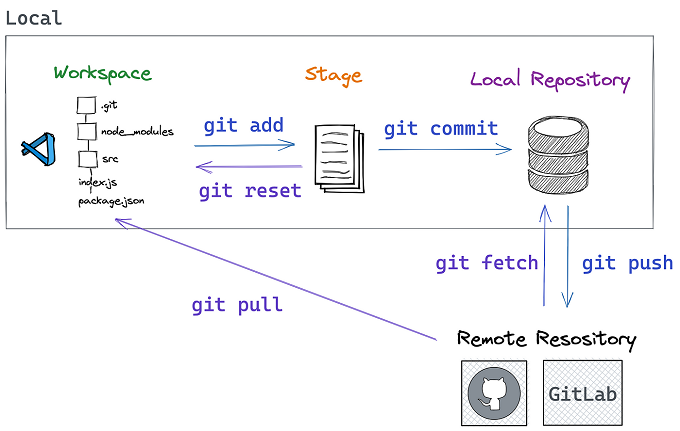
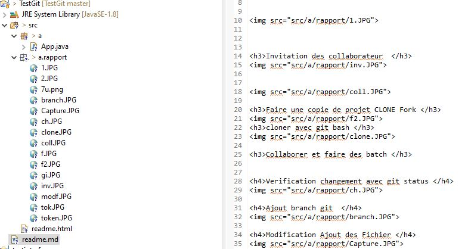
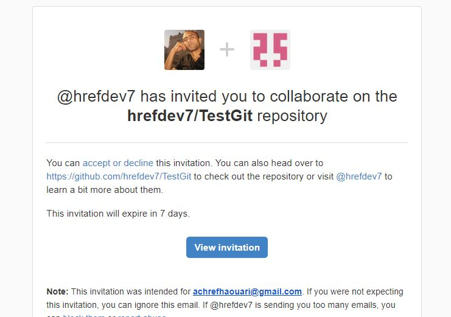
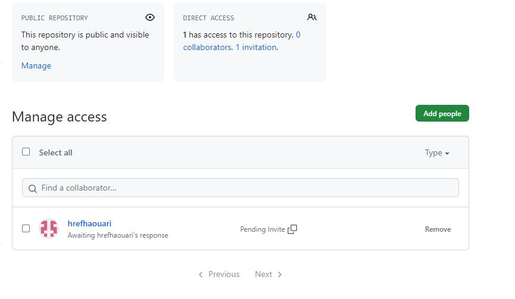
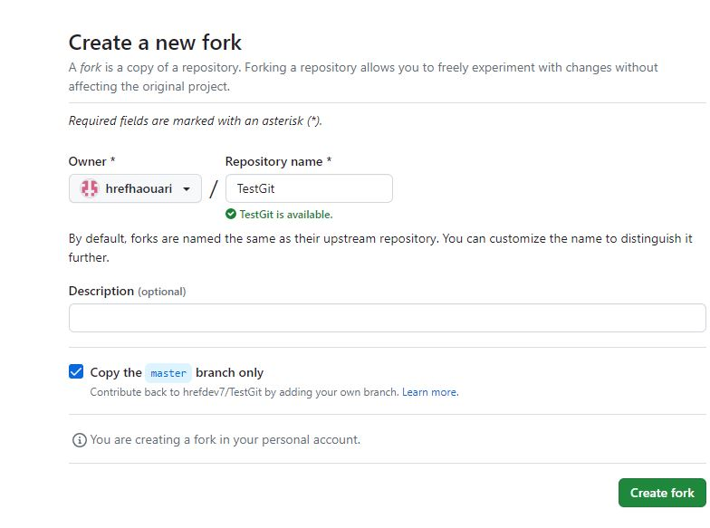
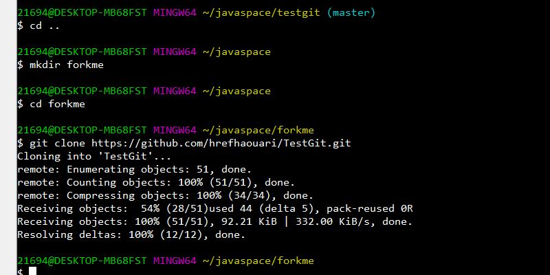
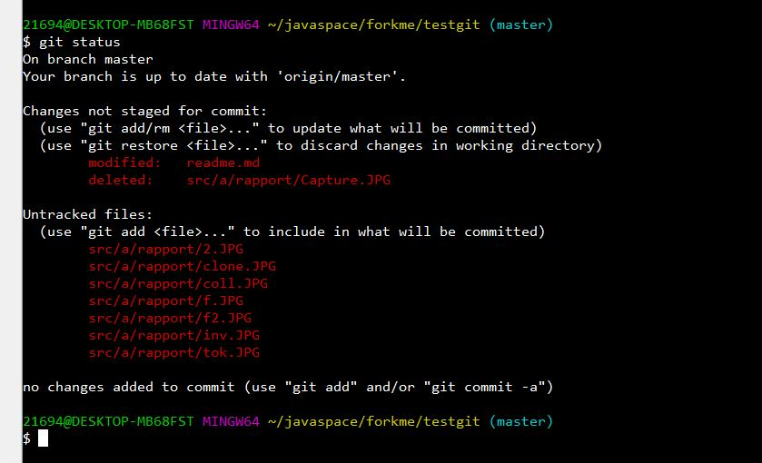
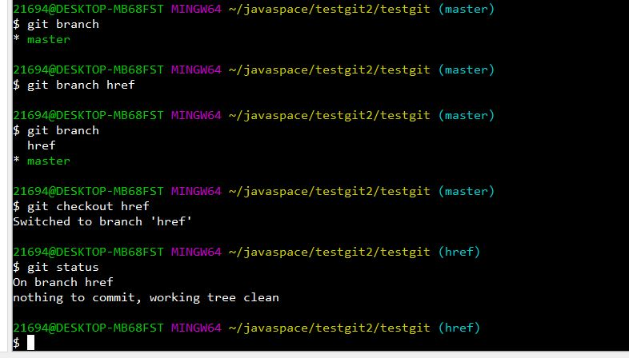
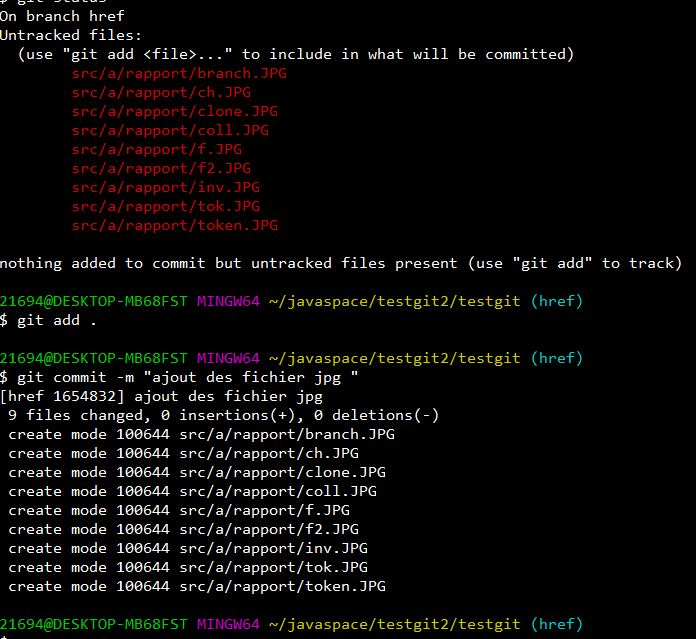

<h2>version control system<h2>

 

<h3>Creation projet java </h3>
 
<h3>Git Commands. Hope it helps</h3>

<h3>Invitation des collaborateur  </h3>

<h3>Faire une copie de projet CLONE Fork </h3>

<h3>cloner avec git bash </h3>

<h3>Collaborer et faire des batch </h3>

<h4>Verification changement avec git status </h4>

<h4>Ajout branch git  </h4>

<h4>Modification Ajout des Fichier </h4>

<h4>Comit et push</h4>

