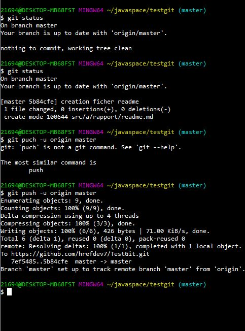
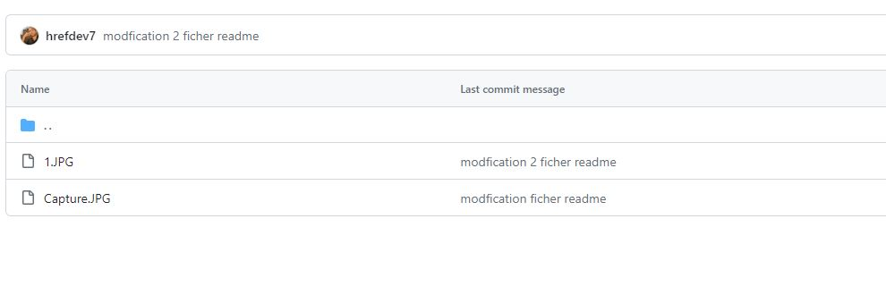

<h3>Compte rendus <h3>

21694@DESKTOP-MB68FST MINGW64 ~/javaspace/testgit (master)
$ git status
On branch master
Your branch is up to date with 'origin/master'.

Changes not staged for commit:
  (use "git add <file>..." to update what will be committed)
  (use "git restore <file>..." to discard changes in working directory)
        modified:   src/a/rapport/readme.md

Untracked files:
  (use "git add <file>..." to include in what will be committed)
        src/a/rapport/Capture.JPG

no changes added to commit (use "git add" and/or "git commit -a")

